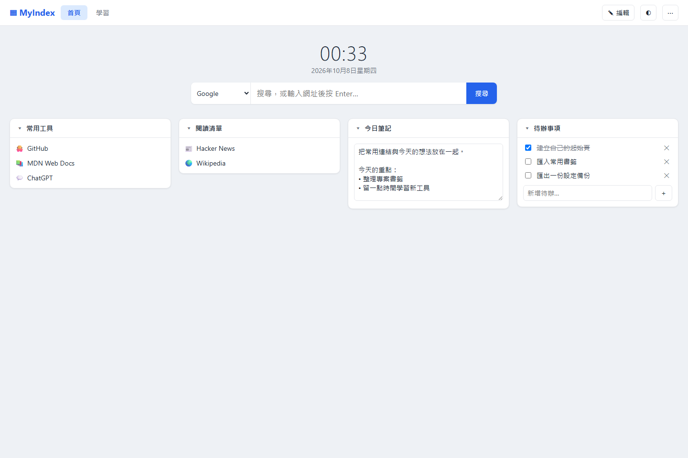
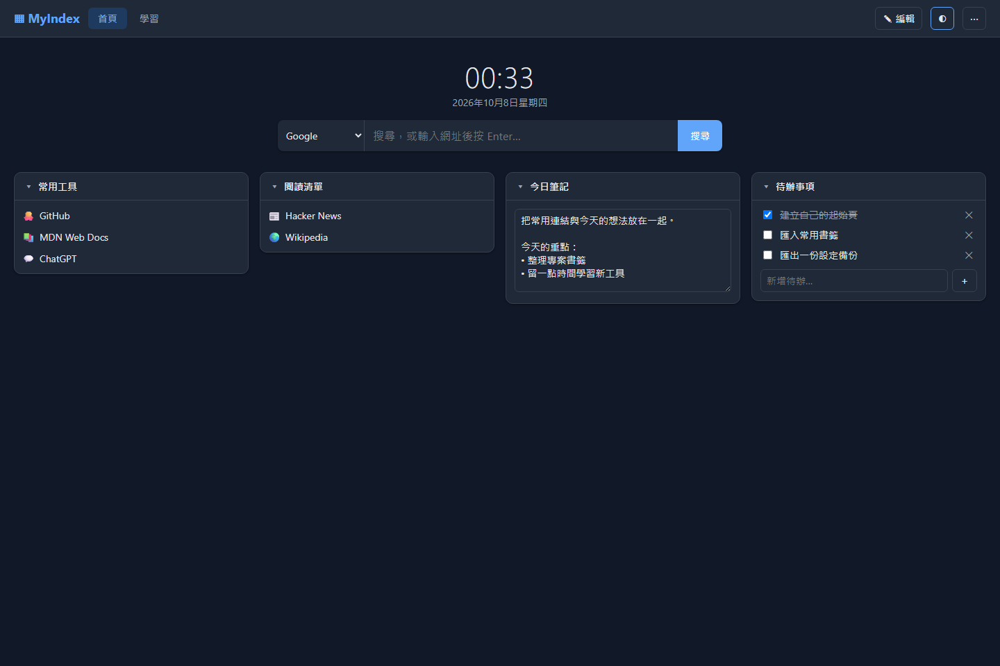
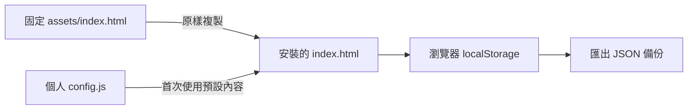

# MyIndex

Personal homepage · Fixed HTML template · AI-ready Skill

**讓 AI 幫你安裝同一套起始頁，把每天會用到的連結、筆記與待辦放在一起。**

MyIndex 是可直接開啟的單檔 HTML 起始頁，也是一份能交給 AI 使用的 Skill。每次安裝都複製專案中的固定範本，個人設定另外保存，避免 AI 每次產生不同的版型。



## 為什麼用 MyIndex Skill？

**本機落地，資料由你掌握。** AI 把頁面安裝到你的電腦，書籤、筆記與待辦儲存在目前瀏覽器，不需要為 MyIndex 註冊帳號，也不依賴雲端資料庫。個人資料不會由本專案自動上傳；搜尋、點擊外部連結或使用外部圖片時，仍會連線到相應網站。

**每次都是同一套版型。** Skill 直接使用隨附的 HTML 範本，AI 負責安裝與整理設定，不必每次重新設計頁面。更新可以保留個人設定，版型也方便維護。

**說出需求，讓 AI 幫你整理。** 不必自己編輯 HTML，就能請 AI 協助安裝、把指定書籤資料夾轉為設定，或產生新增連結的匯入片段。

**輕量、可攜、可備份。** 頁面不需要後端伺服器或套件建置；匯出 JSON 就能備份個人內容，再帶到另一台電腦使用。固定範本與個人資料分開，也方便分享一套不含個資的工具給同事。

## 一頁開始今天的工作

| 功能 | 使用方式 |
| --- | --- |
| 分頁與書籤區塊 | 依工作、學習或生活整理連結 |
| 筆記與待辦 | 直接輸入、自動儲存在目前瀏覽器 |
| 拖曳排序 | 編輯模式移動區塊、連結，或拖到另一個分頁 |
| 搜尋列與時鐘 | 開啟頁面就能搜尋及查看時間 |
| 深色／淺色主題 | 用右上角主題按鈕切換 |
| 自訂圖示 | Emoji 或明確指定的 HTTPS 圖片 |
| 本地路徑 | 保存資料夾、檔案及網路分享路徑；也可複製路徑 |
| 匯入／匯出 | 支援設定 JSON 與瀏覽器匯出的書籤 HTML |



## 快速試用

下載完整專案，解壓後在專案資料夾開啟 PowerShell：

```powershell
# 安裝到使用者資料夾的 MyIndex
powershell.exe -NoProfile -File .\scripts\install.ps1

# 安裝範例內容到指定資料夾
powershell.exe -NoProfile -File .\scripts\install.ps1 -Target D:\MyMyIndex -Config .\examples\default.json
```

用 Edge 或 Chrome 開啟安裝位置的 `index.html`。不需要 Node.js、資料庫或網站伺服器。安裝腳本供 Windows PowerShell 5.1+ 使用；其他平台可手動複製 `assets/index.html`，以支援現代 JavaScript 的瀏覽器開啟。

## 交給 AI 安裝

把完整專案放進 AI 工具的 skills 目錄，或直接提供 `SKILL.md` 的位置，並確保 `assets/` 與 `scripts/` 一起保留。

你可以說：

> 使用這份 myindex Skill，幫我安裝起始頁並加入常用連結。使用固定範本，不修改版型。

> 更新我的起始頁，保留原本的安裝位置、設定與瀏覽器資料。

> 把這三個網址整理成可匯入起始頁的 JSON 片段。

Skill 支援能讀取本機檔案並執行 PowerShell 的 AI 工作環境。網頁聊天若沒有本機執行能力，仍可閱讀指令並協助產生設定。

## 為什麼每次看起來一致？



安裝程式複製完整範本，SHA-256 可用來確認檔案逐位元一致。分頁名稱、連結及筆記放在設定資料中；同一版範本與相同設定會得到相同介面結構，時間、內容與瀏覽器字型等仍可能不同。

`config.js` 的格式如下，JSON 結構可參考 [examples/default.json](examples/default.json)：

```javascript
window.STARTPAGE_DEFAULT = { /* 設定 JSON */ };
```

已有 localStorage 時會優先載入已儲存資料，修改 `config.js` 不會直接覆蓋既有內容。要套用新設定，請在頁面「⋯ → 匯入」選擇 JSON。

## 日常操作

1. 按「編輯」新增分頁、書籤區塊與連結。
2. 在編輯模式拖曳排序；拖到分頁標籤可跨分頁移動。
3. 筆記及待辦會自動儲存。
4. 使用「⋯ → 匯出設定」備份，換瀏覽器或電腦時再匯入。

完整 JSON（含 `pages`）會取代目前設定，頁面會先確認；只有 `widgets` 的片段會合併連結並略過相同網址。

## 從 Edge／Chrome 書籤建立設定

```powershell
# 只列出資料夾與連結數，不列網址
powershell.exe -NoProfile -File .\scripts\bookmarks-to-config.ps1 -List
```

再以 PowerShell 呼叫腳本，指定你選擇的資料夾：

```powershell
& .\scripts\bookmarks-to-config.ps1 -Folders '書籤列/工作','書籤列/學習' -Out .\my-default.json
& .\scripts\install.ps1 -Config .\my-default.json
```

加上 `-Browser Chrome` 可改用 Chrome；非 Default 設定檔可用 `-Path` 指定 Bookmarks 檔。腳本不修改原書籤，也不匯入行動裝置書籤。

## 設成瀏覽器首頁

在 Edge／Chrome 的啟動設定中選「開啟特定頁面」，填入安裝程式輸出的 `file:///` 網址。首頁按鈕也可以使用該網址。新分頁通常需要另用擴充功能；公司裝置若有管理原則，請改用書籤或釘選分頁。

## 資料與更新

- 個人資料存在瀏覽器 `localStorage`，鍵值為 `startpage.v1`；不會由本專案同步到雲端。
- 為相容舊版，保留 `startpage.v1` 與 `window.STARTPAGE_DEFAULT` 設定名稱；產品與 Skill 名稱為 MyIndex。
- 清除瀏覽資料、換瀏覽器或移動 HTML 路徑，可能看不到舊資料，請先匯出備份。
- 外部連結、搜尋及明確指定的 HTTPS 圖片會連線到對應網站；預設圖示使用字母或 Emoji，不會自動向書籤網站請求 favicon。
- 更新請使用同一個安裝路徑。不傳 `-Config` 時會保留現有 `config.js`，舊 HTML 備份為 `.bak`。
- 本地路徑能否直接開啟取決於瀏覽器限制，可使用複製路徑功能。
- 請勿將個人設定、內部網址、Token 或真實書籤提交到公開 repository。

## 專案結構

```text
SKILL.md                       AI 使用指引與固定範本規則
assets/index.html              唯一 HTML 範本
scripts/install.ps1            安裝／更新
scripts/bookmarks-to-config.ps1 書籤轉設定
examples/default.json          不含個資的範例內容
docs/images/                   實際頁面截圖
```

採用 [MIT License](LICENSE)，可使用、修改與散布，請保留授權聲明。
